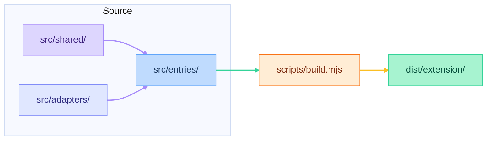

# MPHelper

MPHelper is a Chrome extension for the **Vendoroo Marketplace** (testing and production). It surfaces work order details from the marketplace API, auto-captures your JWT, and adds optional tooling for image-analysis review workflows.

Supported pages:

- `https://testing-marketplace.vendoroo.ai/*`
- `https://marketplace.vendoroo.ai/*`

## Features

- **Work order helper dialog** — open with a keyboard shortcut (default `Ctrl+Shift+M`) to view and copy:
  - Request ID (UUID from the URL)
  - Work order title
  - Work order ID
  - Work order number
  - Resident user ID
  - Raw API response JSON
- **JWT auto-capture** — stores the bearer token per environment when the marketplace site calls its API (no manual paste required).
- **Settings popup** — click the extension icon to open MPHelper on the active tab or change settings (shortcut, image-analysis toggle).
- **Image analysis copy** (optional) — when enabled in Settings, adds a **Copy for AI review** button next to resident request images. Copies the image and a structured LLM prompt to the clipboard for scoring automated descriptions.

## Install

See [INSTALL.md](INSTALL.md) for the team install guide (Load unpacked from a shared zip).

For local development:

1. Run `make setup` or `make build` (see [Development](#development)) so `dist/extension/` exists.
2. Open `chrome://extensions`.
3. Enable **Developer mode**.
4. Click **Load unpacked** and select the `dist/extension/` folder.
5. After rebuilding, click **Reload** on the MPHelper extension card.

## Usage

1. Open a work order page on the testing or production marketplace.
2. Use the site normally — MPHelper captures the JWT from API requests in the background.
3. Press **`Ctrl+Shift+M`** (or your custom shortcut), or click the extension icon and choose **Open**, to open the MPHelper dialog.
4. Click any value chip to copy it to the clipboard.
5. To change the shortcut, click the extension icon and use **Settings → Change**.
6. To enable image-analysis copy buttons, click the extension icon and turn **Image analysis copy** on.

If work order fields show *No token yet — use the site to load data*, refresh or navigate until the page has made an authenticated API call.

## Development

### Prerequisites

- [Node.js](https://nodejs.org/) (for the build step only; the shipped extension has no runtime Node dependency)
- `make` (optional but recommended — wraps common tasks)

### Quick start

```bash
make setup    # install deps + build (first time)
make build    # rebuild after editing src/
make help     # list all commands
```

### Make commands

| Command | Description |
|---------|-------------|
| `make help` | List available commands (default) |
| `make setup` | Install dependencies and build |
| `make install` | Install Node dev dependencies |
| `make build` | Build Chrome extension |
| `make rebuild` | Clean `dist/` and rebuild |
| `make clean` | Remove `dist/` |
| `make clean-all` | Remove `dist/` and `node_modules/` |
| `make check` | Build and verify output files exist |
| `make package` | Build and zip `dist/extension/` for sharing |
| `make version` | Print current semver from `package.json` |
| `make paths` | Print absolute path for Load unpacked |

Equivalent npm usage:

```bash
npm install   # once
npm run build
```

### Build output

| Output | Purpose |
|--------|---------|
| `dist/extension/` | Chrome extension (`manifest.json`, `content.js`, `popup.html`, `popup.js`, `page-interceptor.js`) |
| `dist/mphelper-extension-v*.zip` | Packaged extension for team sharing (`make package`) |

**Edit source in `src/`, not the generated files.** Version is defined in `package.json` and synced to the extension manifest.

### Project layout

```
src/
  shared/       # UI, API helpers, clipboard, image analysis
  adapters/     # chrome.storage.local and fetch wrappers
  entries/      # extension-content.js, extension-popup.js
extension-static/
  manifest.json # MV3 template
scripts/
  build.mjs     # esbuild bundler
Makefile        # install, build, clean, check, package, …
```

The extension uses `chrome.storage.local`, `fetch` (via `host_permissions`), and a page-world script (`page-interceptor.js`) to capture JWTs from the site's own network calls.

### Versioning

Follow [semantic versioning](https://semver.org/): bump `package.json` `version`, then run `make build`.

- **PATCH** — bug fixes
- **MINOR** — backward-compatible features or UX
- **MAJOR** — breaking behavior changes

### Manual test checklist

After changes, verify on **testing** and **production**:

1. JWT auto-captured after normal site use
2. Shortcut opens dialog; WO fields load
3. Click-to-copy works on all chips and **Copy API Response**
4. Settings shortcut editor and reset work; new shortcut persists across reload
5. Image analysis copy toggle injects buttons and copies image + prompt (or text fallback)

See [AGENTS.md](AGENTS.md) for agent-oriented conventions and API details.

## Architecture



## License

Internal Vendoroo tooling. No license file is included; treat as private unless your team specifies otherwise.
